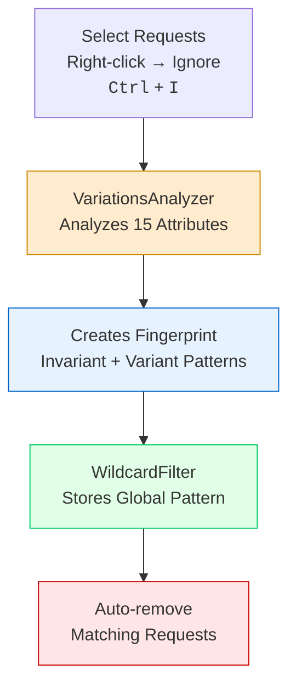

The "Ignore Request" feature uses intelligent response fingerprinting to identify and automatically remove similar responses. Perfect for filtering out error pages, 404s, and other noise during fuzzing operations.

## How It Works

When you ignore requests, MutaFuzz:

1. **Analyzes responses** - Examines 15+ attributes to create a fingerprint
2. **Stores patterns** - Saves the fingerprint globally for all future requests
3. **Auto-filters** - Automatically removes matching requests from the table
4. **Background processing** - Handles large selections without freezing UI



## Quick Start

### Basic Usage

<Steps>
  <Step title="Select requests to ignore">
    Click rows in the table, or use <kbd>Ctrl</kbd> + **Click** / <kbd>Shift</kbd> + **Click** for multiple selection
  </Step>

  <Step title="Right-click and choose 'Ignore Requests'">
    Or press <kbd>Ctrl</kbd> + <kbd>I</kbd> keyboard shortcut
  </Step>

  <Step title="Wait for processing">
    Progress dialog shows fingerprinting progress
  </Step>

  <Step title="Matching requests removed">
    All similar requests automatically disappear from the table
  </Step>
</Steps>

### Example Scenario

You're fuzzing for SQL injection and getting hundreds of 404 error pages:

```text
1. Receive 500 requests, 400 are 404 pages
2. Select one 404 request
3. Right-click → Ignore Requests (<kbd>Ctrl</kbd> + <kbd>I</kbd>)
4. System fingerprints the 404 response
5. All 400 similar 404s automatically removed
6. Left with 100 unique responses to analyze
```

## Fingerprinting Mechanism

### Analyzed Attributes

WildcardFilter analyzes **15 response attributes** to create a comprehensive fingerprint:

| Attribute | Type | Description |
|-----------|------|-------------|
| **Status Code** | Integer | HTTP status (200, 404, 500, etc.) |
| **Content Length** | Integer | Response body size in bytes |
| **Content Type** | String | MIME type (text/html, application/json) |
| **Location** | String | Redirect location header |
| **ETag** | String | Entity tag header |
| **Last-Modified** | String | Last modification timestamp |
| **Cookie Names** | String[] | Names of Set-Cookie headers |
| **Word Count** | Integer | Number of words in response body |
| **Initial Content** | String | First N characters of response |
| **Page Title** | String | HTML `<title>` tag content |
| **First Header** | String | First `<h1>` tag content |
| **Line Count** | Integer | Number of lines in response |
| **Limited Body** | String | Truncated response body sample |
| **Outbound Edges** | Integer | Number of links in HTML |
| **Content Location** | String | Content-Location header |

### Similarity Detection

The system uses **statistical analysis** to determine similarity:

- Tracks which attributes are **invariant** (same across all samples)
- Tracks which attributes are **variant** (different but within tolerance)
- Considers response "similar" if invariant attributes match

**Example fingerprint:**
```text
Invariants:
  - Status Code: 404
  - Content Type: text/html
  - Page Title: "Not Found"
  - Word Count: 42

Variants (ignored):
  - Content Length: varies ±5%
  - Outbound Edges: varies
```

## Global Pattern Storage

Ignored patterns apply globally to:

- All requests in the current table
- All future requests added to the table
- All fuzzing operations in the current session

<Info>
Once you ignore a pattern (like 404 pages), you won't see similar responses again until you clear the filter.
</Info>

## Use Cases

### Filtering Error Pages

**Scenario**: Testing for LFI, getting 403 Forbidden on invalid paths

1. Select a 403 response
2. Ignore Requests (<kbd>Ctrl</kbd> + <kbd>I</kbd>)
3. All similar 403 pages hidden
4. Focus on responses that differ

### Removing Default Responses

**Scenario**: Fuzzing parameters, getting default page when param is invalid

1. Select the default page response
2. Ignore Requests
3. Only parameter-sensitive responses remain

### Hiding Rate Limit Responses

**Scenario**: API fuzzing hitting rate limits (429 Too Many Requests)

1. Select a 429 response
2. Ignore Requests
3. Rate limit responses automatically hidden
4. See only successful/interesting responses

### Filtering WAF Blocks

**Scenario**: WAF blocking requests with similar block page

1. Select a WAF block response
2. Ignore Requests
3. All WAF blocks hidden
4. Focus on requests that bypass WAF


## Next Steps

<CardGroup cols={2}>
  <Card title="Filter Syntax" icon="filter" href="/request-table/filtering">
    Combine with filter expressions
  </Card>

  <Card title="Custom Columns" icon="table-columns" href="/request-table/custom-columns">
    Add Boolean and Regex columns
  </Card>
</CardGroup>
