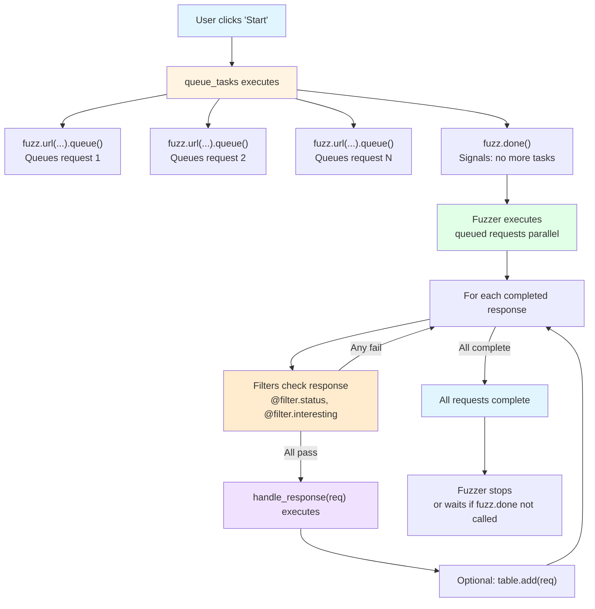

# Scripting Overview

MutaFuzz provides a powerful Python scripting environment that lets you create custom HTTP fuzzing workflows. Write Python code to generate payloads, process responses, chain requests, and implement advanced testing strategies.

## Quick Start

Here's a complete working script - copy, paste, and run:

```python
# Queue tasks - runs once
def queue_tasks():
    # Calibrate with random strings (learn groups 1-3)
    for i in range(3):
        payload = utils.randstr(length=8)
        fuzz.payloads([payload]).learn_group(i + 1).queue()

    # Fuzz with real wordlist
    for url in payloads.wordlist(1):
        fuzz.url(url).queue()

    fuzz.done()

# Handle responses - runs once per response
@filter.interesting()  # Only interesting responses
def handle_response(req):
    table.add(req)  # Add to results table
```

This script:
1. Calibrates with 3 random payloads (learn mode automatically filters duplicates)
2. Fuzzes URLs from wordlist 1
3. Shows only interesting responses in results table

See [Examples](/scripting/examples) for more patterns.

---

## Philosophy

**Pythonic, not Java-esque.** MutaFuzz's scripting API is designed around Python idioms:

- **Fluent builders** - Chain method calls naturally: `fuzz.url(url).learn_group(1).queue()`
- **Decorator filters** - Stack response filters like middleware: `@filter.status([200]) @filter.interesting()`
- **Property access** - Access response data with dot notation: `req.status`, `req.length`, `req.interesting`
- **Familiar utilities** - Work with standard patterns: `encode.base64()`, `hash.md5()`, `session.set()`

## Script Lifecycle

Every MutaFuzz script follows a two-phase lifecycle:

### Phase 1: Queue Tasks (`queue_tasks()`)

Generate and queue all fuzzing requests. Runs **once** when you click "Start".

```python
def queue_tasks():
    """Queue all fuzzing tasks - runs once at start."""
    for url in payloads.wordlist(1):
        fuzz.url(url).queue()  # Async: queues request, returns immediately

    fuzz.done()  # Signal: no more tasks coming
```

**Key concepts:**

- `.queue()` - Queues request asynchronously, returns immediately
- `.send()` - Sends request synchronously, blocks until response received
- `fuzz.done()` - **Required** - Signals that all tasks are queued (fuzzer waits for queue to drain)

### Phase 2: Handle Responses (`handle_response()`)

Process each completed response. Runs **many times** (once per response).

```python
@filter.status([200, 201])
@filter.interesting()
def handle_response(req):
    """Process each response - runs once per completed request."""
    table.add(req)  # Add to results table
```

**Key concepts:**

- Decorators filter which responses reach your handler
- `req` is a `RequestObject` with properties: `status`, `length`, `text`, `body`, `interesting`
- `table.add(req)` adds response to UI table
- Filters stack top-to-bottom (only responses passing all filters reach handler)

<Accordion title="Complete lifecycle diagram">

</Accordion>

## Injected Variables

MutaFuzz automatically injects these variables into your script's global scope:

| Variable | Type | Description |
|----------|------|-------------|
| `api` | `MontoyaApi` | Burp Suite Montoya API (alias: `burp_api`) |
| `handler` | `PythonScriptBridge` | Bridge to fuzzer engine (use high-level APIs instead) |
| `fuzz` | `FuzzerAPI` | **Main fuzzing API** - queue/send requests |
| `filter` | `class` | **Response filter decorators** - status, interesting, etc. |
| `table` | `class` | **Results table API** - add(), add_if() |
| `session` | `class` | **State storage** - set(), get(), increment() |
| `payloads` | `class` | **Wordlist access** - wordlist(1/2/3), all() |
| `templates` | `class` | **Template access** - get(), all(), count() (Multiple Requests mode) |
| `encode` | `class` | **Encoding** - base64(), url(), html(), json() |
| `decode` | `class` | **Decoding** - base64(), url(), html(), json() |
| `hash` | `class` | **Hashing** - md5(), sha256() |
| `utils` | `class` | **Utilities** - randstr(), sleep(), chunked(), http_request_from_url() |

### Private Variables (advanced use)

| Variable | Type | Description |
|----------|------|-------------|
| `_wordlist_1` | `list[str]` | Raw wordlist 1 (use `payloads.wordlist(1)` instead) |
| `_wordlist_2` | `list[str]` | Raw wordlist 2 (use `payloads.wordlist(2)` instead) |
| `_wordlist_3` | `list[str]` | Raw wordlist 3 (use `payloads.wordlist(3)` instead) |
| `_java_raw_http_list` | `list[HttpRequestResponse]` | Raw template list (use `templates.all()` instead) |

<Note>
Access injected variables directly - no imports needed:

```python
# ✅ Correct - variables are global
def queue_tasks():
    for url in payloads.wordlist(1):
        fuzz.url(url).queue()

# ❌ Wrong - no imports needed
from mutafuzz import fuzz  # Error: no such module
```
</Note>

## Async vs Sync

MutaFuzz supports two execution modes:

### Async Mode (`.queue()`) - Recommended

Queue requests for parallel execution. **Fast** - doesn't block.

```python
def queue_tasks():
    # Queue 1000 URLs - returns immediately
    for url in payloads.wordlist(1):
        fuzz.url(url).queue()  # Returns instantly

    fuzz.done()  # Required for .queue()

# handle_response() processes responses as they complete
@filter.interesting()
def handle_response(req):
    table.add(req)
```

**When to use:**
- Standard fuzzing (URLs, payloads, templates)
- Independent requests
- High throughput needed

### Sync Mode (`.send()`) - Advanced

Send request and block until response received. **Slow** - blocks script.

```python
def queue_tasks():
    # Send request and wait
    req = utils.http_request_from_url("https://example.com/uuid")
    resp1 = fuzz.http_request(req).send()  # Blocks here

    # Use response data in next request
    uuid = extract_uuid(resp1.body)
    req2 = utils.http_request_from_url(f"https://example.com/data/{uuid}")
    resp2 = fuzz.http_request(req2).send()  # Blocks here

    table.add(resp2)
    fuzz.done()

# handle_response() NOT called for .send() requests
def handle_response(req):
    pass  # Never runs
```

**When to use:**
- Request chaining (use response 1 in request 2)
- Multi-step authentication flows
- Sequential workflows

<Accordion title="Async vs Sync comparison">
| Feature | `.queue()` | `.send()` |
|---------|------------|----------|
| **Speed** | Fast (parallel) | Slow (sequential) |
| **Blocking** | Non-blocking | Blocks until response |
| **Callback** | Yes (`handle_response()`) | No (returns `RequestObject`) |
| **Auto-table** | Via `handle_response()` | Manual (`table.add()`) |
| **Use case** | Standard fuzzing | Request chaining |

```python
# Async - 1000 requests complete in ~10 seconds
for payload in range(1000):
    fuzz.url(f"https://example.com/{payload}").queue()

# Sync - 1000 requests complete in ~1000 seconds (if 1 req/sec)
for payload in range(1000):
    resp = fuzz.url(f"https://example.com/{payload}").send()
    # Process response inline
```
</Accordion>

## Next Steps

<CardGroup cols={2}>
  <Card title="Template Structure" icon="file-code" href="/scripting/template-structure">
    Learn the anatomy of a MutaFuzz script
  </Card>
  <Card title="API Reference" icon="book" href="/scripting/api-reference">
    Complete API documentation with examples
  </Card>
  <Card title="Examples" icon="code" href="/scripting/examples">
    Real-world fuzzing scripts and patterns
  </Card>
  <Card title="Learn Mode" icon="brain" href="/scripting/learn-mode">
    Automatic response filtering and calibration
  </Card>
</CardGroup>
