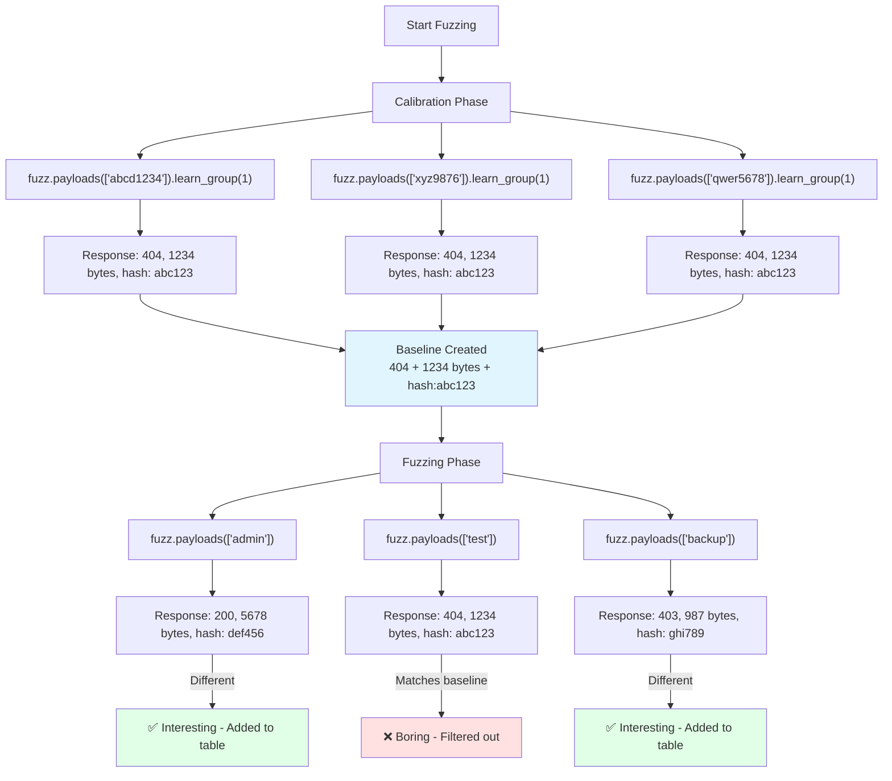

# Learn Mode

Learn mode automatically filters boring/baseline responses by calibrating with random payloads before fuzzing. Only responses that **differ** from the baseline appear in results.

## The Problem

Traditional fuzzing floods you with noise:
- 10,000 payloads → 9,950 identical 404s
- Manual filtering wastes time
- Easy to miss interesting responses in the noise

**Learn mode solves this** by fingerprinting baseline responses during calibration, then automatically filtering them out.

## How It Works

### 1. Calibration Phase (Learn Groups)

Send random payloads to establish baseline response signatures:

```python
# Calibration - learn what 404s look like
for i in range(5):
    payload = utils.randstr(8)
    fuzz.payloads([payload]).learn_group(1).queue()
```

**What's captured:**
- Response status code
- Response body length
- Response body hash (MD5)
- Header patterns

### 2. Fuzzing Phase

Send real payloads without learn group:

```python
# Fuzzing - compare against calibration baseline
for payload in payloads.wordlist(1):
    fuzz.payloads([payload]).queue()  # No .learn_group()
```

### 3. Automatic Filtering

Responses are compared against calibration baseline:
- **Interesting** = Different from ALL calibration responses
- **Boring** = Matches any calibration response

```python
@filter.interesting()
def handle_response(req):
    # Only sees responses different from baseline
    table.add(req)
```

## Visual Workflow



## Basic Usage

### Single Learn Group

Simplest pattern - one baseline:

```python
def queue_tasks():
    # Calibration: 5 random payloads
    for i in range(5):
        payload = utils.randstr(8)
        fuzz.payloads([payload]).learn_group(1).queue()

    # Wait for calibration to complete
    utils.sleep(500)

    # Fuzzing: real payloads
    for payload in payloads.wordlist(1):
        fuzz.payloads([payload]).queue()

    fuzz.done()

@filter.interesting()
def handle_response(req):
    table.add(req)
```

**Use case:** Simple directory fuzzing where all 404s look identical.

---

## Advanced: Multiple Learn Groups

Use multiple groups to fingerprint different response patterns.

### Pattern 1: Different URL Structures

```python
def queue_tasks():
    base_url = "https://example.com/"

    # Learn group 1: Non-existent files
    for i in range(5):
        payload = utils.randstr(12)
        fuzz.url(base_url + payload).learn_group(1).queue()

    # Learn group 2: Non-existent with extension
    for i in range(5):
        payload = utils.randstr(12) + ".php"
        fuzz.url(base_url + payload).learn_group(2).queue()

    # Learn group 3: Non-existent directories
    for i in range(5):
        payload = utils.randstr(12) + "/"
        fuzz.url(base_url + payload).learn_group(3).queue()

    utils.sleep(500)

    # Fuzz against ALL baselines
    for path in payloads.wordlist(1):
        fuzz.url(base_url + path).queue()

    fuzz.done()

@filter.interesting()
def handle_response(req):
    table.add(req)
```

**Why multiple groups?**
- Different URL patterns → different 404 pages
- `/nonexistent` might show different error than `/nonexistent.php`
- Learn mode captures all variations

---

### Pattern 2: Buffer Overflow Responses

```python
def queue_tasks():
    # Learn group 1: Normal 404s
    for i in range(5):
        fuzz.payloads([utils.randstr(8)]).learn_group(1).queue()

    # Learn group 2: Server errors from overflow
    for i in range(5):
        payload = "A" * (1000 + i * 100)
        fuzz.payloads([payload]).learn_group(2).queue()

    utils.sleep(500)

    # Fuzz - anything different from 404s AND 500s is interesting
    for payload in payloads.wordlist(1):
        fuzz.payloads([payload]).queue()

    fuzz.done()

@filter.interesting()
def handle_response(req):
    table.add(req)
```

**Use case:** WAF/IDS testing where overflow attempts trigger different errors.

---

## Troubleshooting

### Problem: Everything Marked as Interesting

**Cause:** Responses vary too much (timestamps, nonces, session IDs in errors).

**Solution:**
1. Increase calibration samples (10-20 instead of 5)
2. Use multiple learn groups for different patterns
3. Check if target has randomization (CSRF tokens, timestamps)

```python
# Before: Too few samples
for i in range(3):  # Only 3 samples
    fuzz.payloads([utils.randstr(8)]).learn_group(1).queue()

# After: More samples captures variation
for i in range(20):  # 20 samples
    fuzz.payloads([utils.randstr(8)]).learn_group(1).queue()
```


---

### Problem: Learn Mode Seems Slow

**Cause:** Calibration requests block fuzzing start.

**Solution:**
1. Reduce calibration samples (3-5 usually enough)
2. Remove `utils.sleep()` if calibration is fast
3. Use background threads (advanced)

```python
# Before: Too many calibration samples
for i in range(100):  # Overkill
    fuzz.payloads([utils.randstr(8)]).learn_group(1).queue()

# After: Optimized
for i in range(5):  # Usually sufficient
    fuzz.payloads([utils.randstr(8)]).learn_group(1).queue()
```

---

## Best Practices

### 1. Calibration Sample Count

- **Minimum:** 3 samples
- **Recommended:** 5-10 samples
- **Maximum:** 20 samples (more = slower, no benefit)

### 2. Randomness Quality

```python
# Good: Truly random
utils.randstr(12)  # Built-in random generator

# Good: Different lengths for variety
for i in range(6, 12, 2):
    utils.randstr(i)

# Bad: Predictable patterns
for i in range(5):
    fuzz.payloads([f"test{i}"]).learn_group(1).queue()
```

### 3. Wait Time

```python
# Give calibration time to complete
utils.sleep(500)  # 500ms usually enough

# For slow targets
utils.sleep(2000)  # 2 seconds
```

### 4. Multiple Groups vs Single Group

**Use single group when:**
- All 404s look identical
- Simple fuzzing scenarios
- Speed is priority

**Use multiple groups when:**
- Different URL structures trigger different errors
- WAF/IDS testing
- Complex applications with varied error responses

---

## Learn Mode vs Manual Filtering

| Approach | Pros | Cons |
|----------|------|------|
| **Learn Mode** | Automatic, adapts to target | Requires calibration phase |
| **Manual `@filter.status([200])`** | Simple, explicit | Misses interesting 404s/500s |
| **Both combined** | Best precision | More complex |

**Recommended:** Use both for maximum precision:

```python
@filter.status_not([500, 502, 503])  # Exclude server errors
@filter.interesting()  # AND learn mode filtering
def handle_response(req):
    table.add(req)
```

---

## Advanced: Learn Groups as Fingerprinting

Think of learn groups as **response fingerprints**:

```python
# Fingerprint 1: Admin area (403 Forbidden)
for i in range(5):
    fuzz.url("https://example.com/admin/" + utils.randstr(8)).learn_group(1).queue()

# Fingerprint 2: API endpoints (401 Unauthorized)
for i in range(5):
    fuzz.url("https://example.com/api/" + utils.randstr(8)).learn_group(2).queue()

# Fingerprint 3: Regular 404s
for i in range(5):
    fuzz.url("https://example.com/" + utils.randstr(8)).learn_group(3).queue()
```

Now fuzzing shows responses different from **all three fingerprints**.

---

## Next Steps

<CardGroup cols={2}>
  <Card title="Examples" icon="code" href="/scripting/examples">
    See learn mode in real-world scripts
  </Card>
  <Card title="API Reference" icon="book" href="/scripting/api-reference">
    `.learn_group()` method details
  </Card>
  <Card title="Template Structure" icon="file-code" href="/scripting/template-structure">
    Script lifecycle and hooks
  </Card>
  <Card title="Overview" icon="home" href="/scripting">
    Back to scripting overview
  </Card>
</CardGroup>
